# ***Integration of JENKINS, GITHUB and DOCKER*** 

# Project Description:
This is a simple website monitoring system with the intergration of CI/CD tools. Where in the code uploded by the developer on their github is downloded and deployed using docker container. This site will be tested and will be monitored throught using jenkins. In any case the website fails it will be relaunched by Jenkins itself.

# **REQUIRED SETUP**
 * install linux OS(suggested redhat8) 
 * install docker in linux.To install [click here](https://docs.docker.com/engine/install/)
 * install jenkins in linux.Information regarding install [click here](https://www.jenkins.io/download/)
 * install git in linux.To install [click here](https://git-scm.com/download/linux)
 
#### Create a Dockerfile that has Jenkins installed.
#### (this docker image is configured in such a way that as soon as the image is launched the Jenkins will start automatically)

    FROM centos
    RUN dnf install wget -y
    RUN yum install sed -y
    RUN wget -O /etc/yum.repos.d/jenkins.repo https://pkg.jenkins.io/redhat-stable/jenkins.repo
    RUN rpm --import https://pkg.jenkins.io/redhat-stable/jenkins.io.key
    RUN yum install jenkins -y
    RUN yum install java-11-openjdk.x86_64 -y
    RUN yum install net-tools -y
    RUN yum makecache && yum install initscripts -y
    RUN yum install sudo -y
    RUN sed -i  "101i jenkins ALL=(ALL) NOPASSWD: ALL" /etc/sudoers
    RUN echo "/etc/rc.d/init.d/jenkins start" > /root/.bashrc
    EXPOSE 808
  
#### Build the image using the following command

    docker build -t myjenkins:v1
    
# **JENKINS**

### Job1 : Pull the github repo automatically when some developer pushes the new code to the repo.
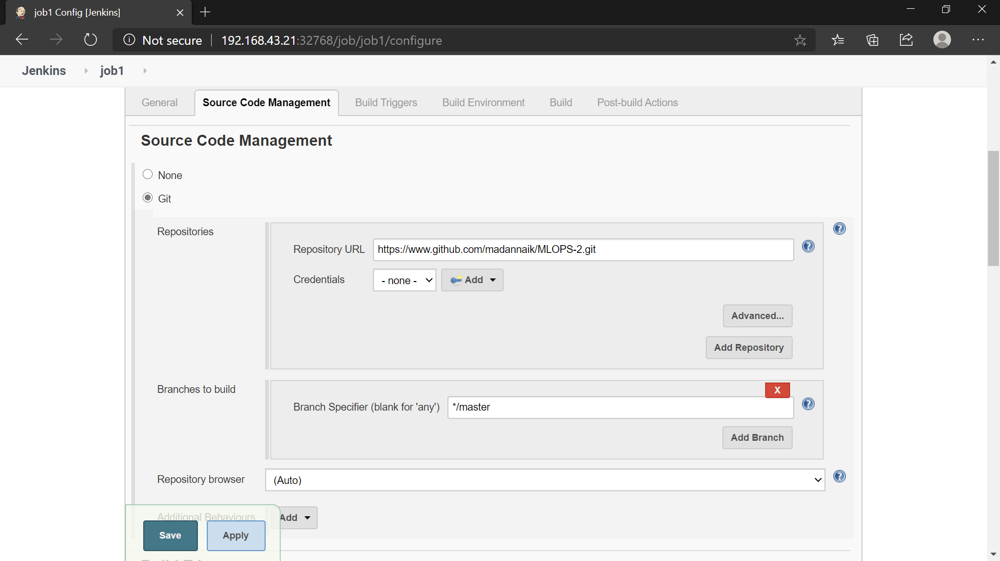
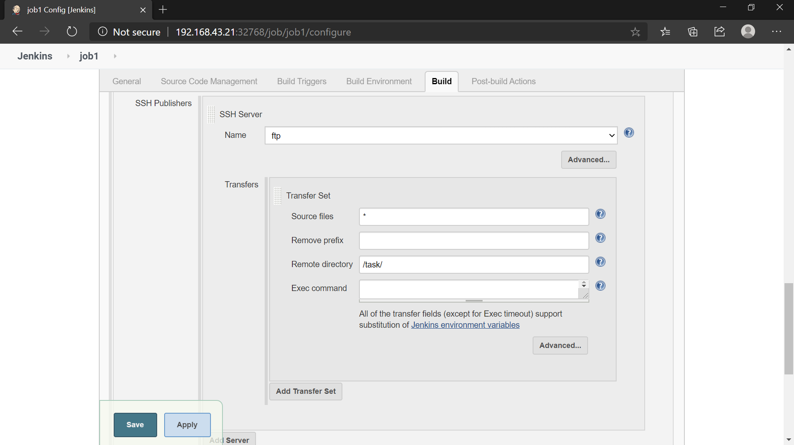

### Job2 : By looking at the code or programfile, jenkins should automatically start the respective language interpreter install image contaier to deploy code.
### (if code is of PHP, then Jenkins should start the container that has PHP already installed)

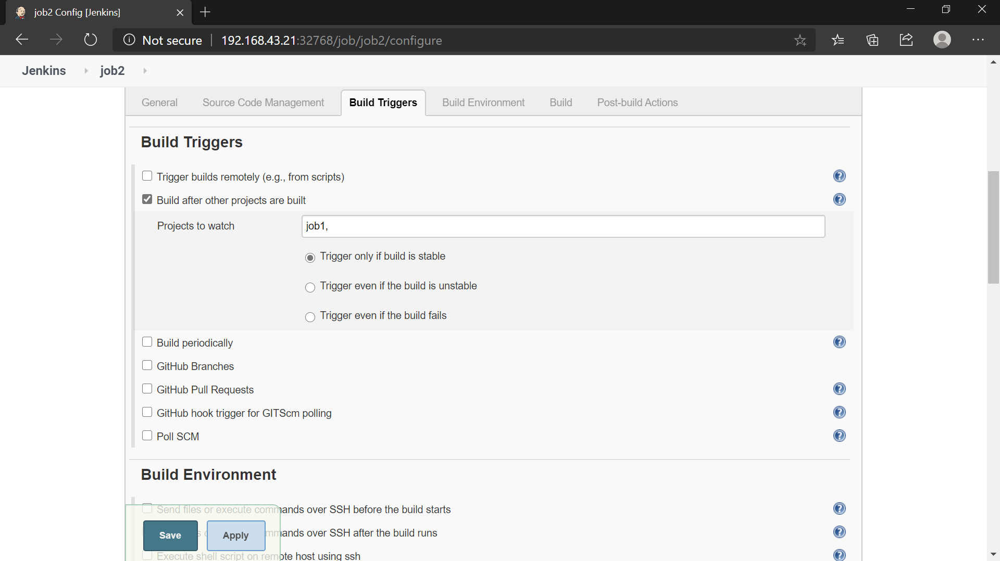
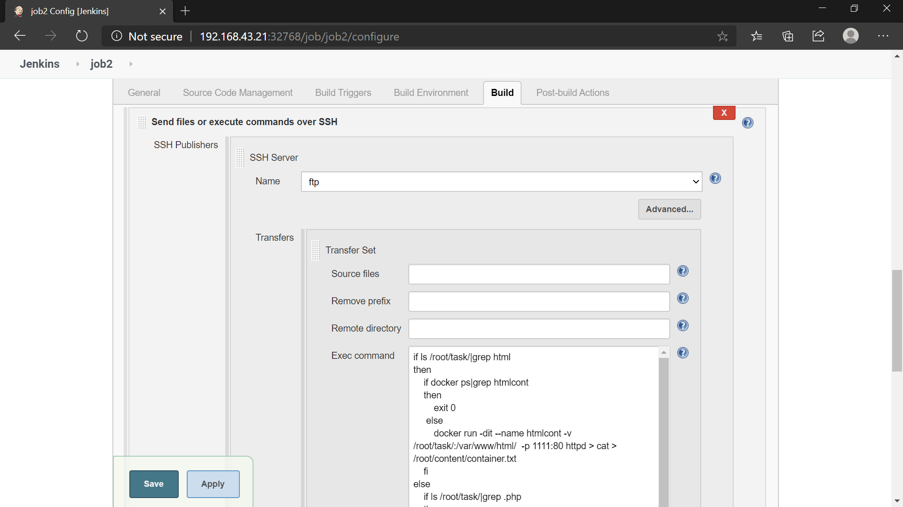
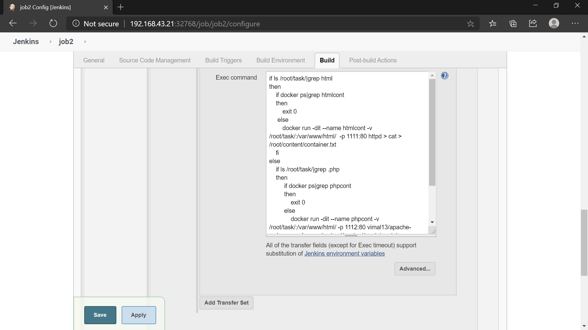

### Execute Shell Code:
        if ls /root/task/|grep html
        then
             if docker ps|grep htmlcont
            then
                exit 0
             else
                docker run -dit --name htmlcont -v /root/task/:/var/www/html/  -p 1111:80 httpd > cat > /root/content/container.txt
            fi
        else
            if ls /root/task/|grep .php
            then
                 if docker ps|grep phpcont
                 then
                     exit 0   
                 else
                     docker run -dit --name phpcont -v /root/task/:/var/www/html/ -p 1112:80 vimal13/apache-webserver-php > cat > /root/content/container.txt
                 fi
            fi      
        fi
    
### Job3 :Check the website if it is running or not, In case is it fails it should send an email to the developer.

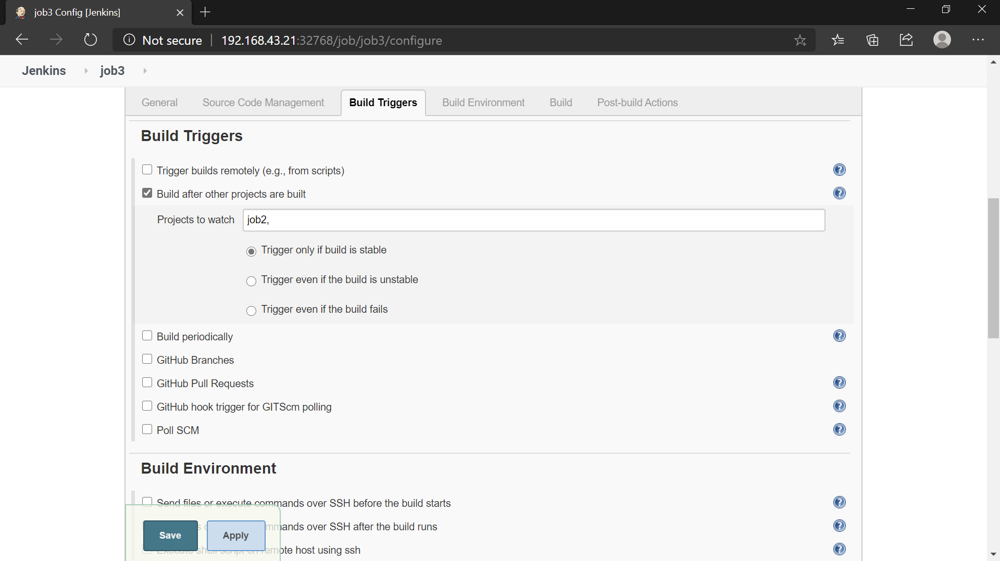
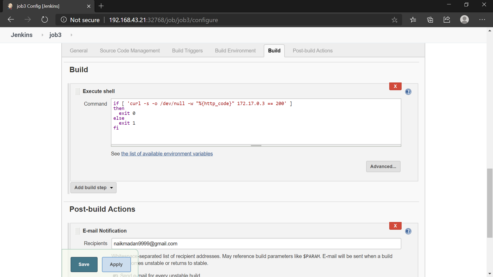
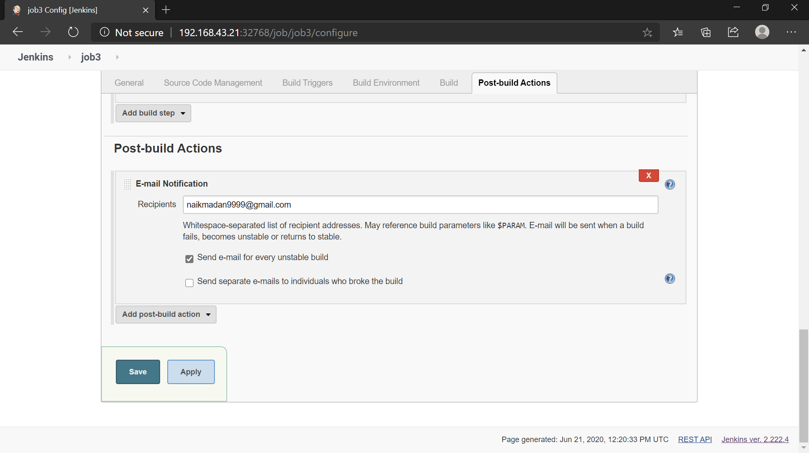

### Execute Shell Code:

    	if [ 'curl -s -o /dev/null -w "%{http_code}" 172.17.0.3 == 200' ]
      then 
          exit 0
      else
          exit 1
      fi

### Job4 : Even if job 3 is stable or it fails due to some internal error it will trigger job 4,which has the role of checking the container launched by job1.
### It has two two works to do.If the container is working fine then gives successful bulid message.If not it will try to remove the excited container and try to relaunch with same configurations.

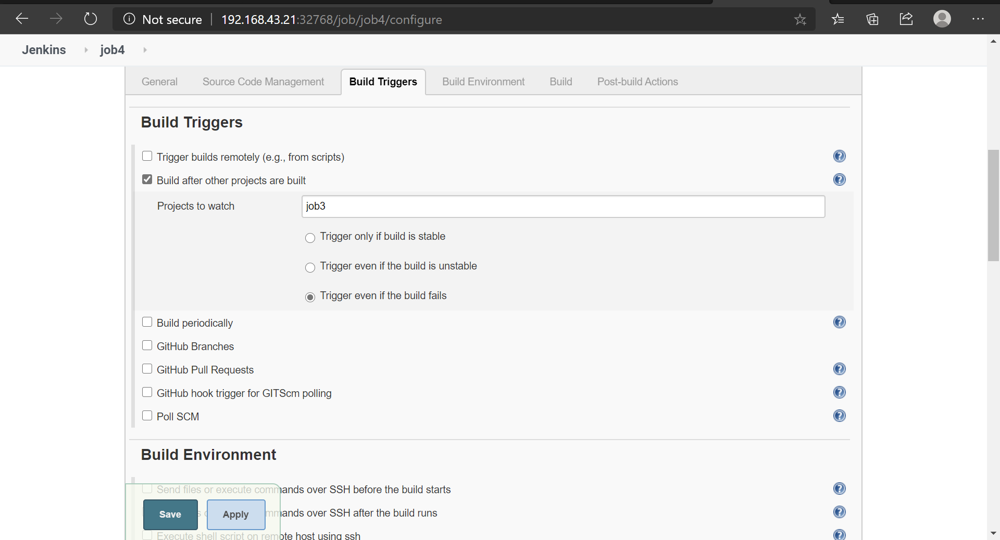
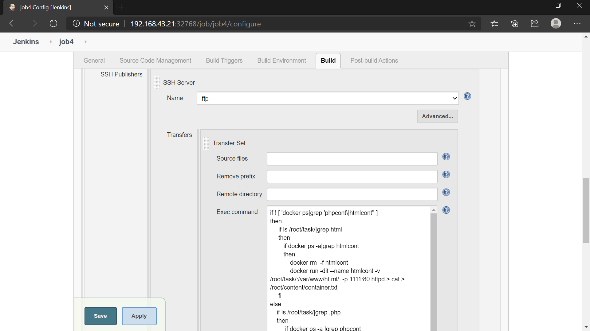
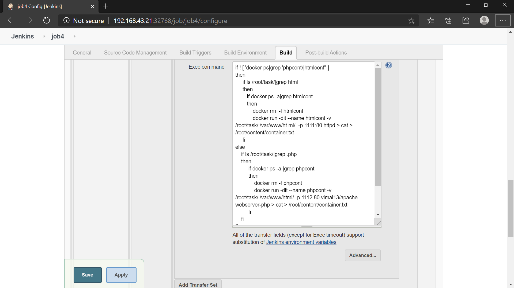

### Execute Shell Code:
    if  ! docker ps|grep 'phpcont\|htmlcont'
    then
        if ls /root/task/|grep html
         then
            if docker ps -a|grep htmlcont
            then
                docker rm  -f htmlcont
                docker run -dit --name htmlcont -v /root/task/:/var/www/ht.ml/  -p 1111:80 httpd > cat > /root/content/container.txt
           fi
        elif ls /root/task/|grep .php
        then
             if docker ps -a |grep phpcont
             then
                 docker rm -f phpcont
                 docker run -dit --name phpcont -v /root/task/:/var/www/html/ -p 1112:80 vimal13/apache-webserver-php > cat > /root/content/container.txt
             fi
         fi      
    else
        echo "WORKING GOOD"
    fi

### Build Pipeline View:
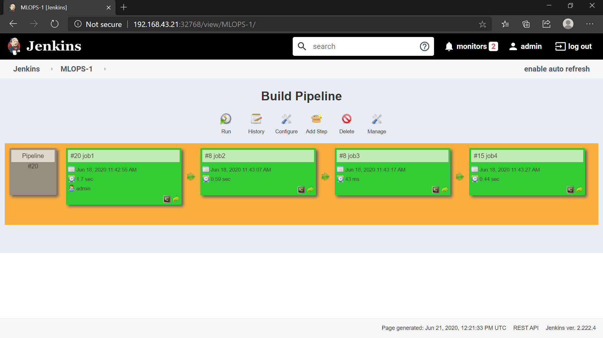
    
## In collobration with : @madannaik

